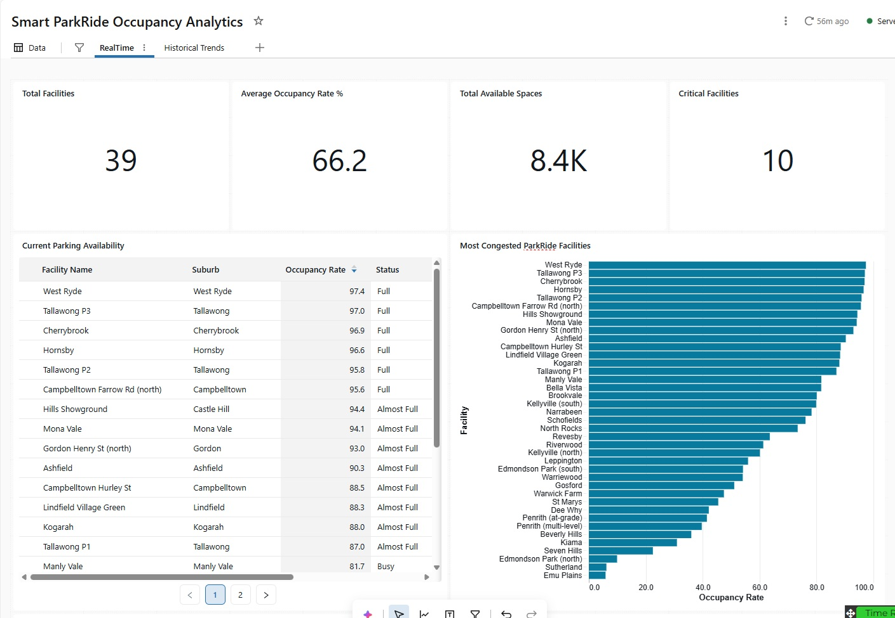
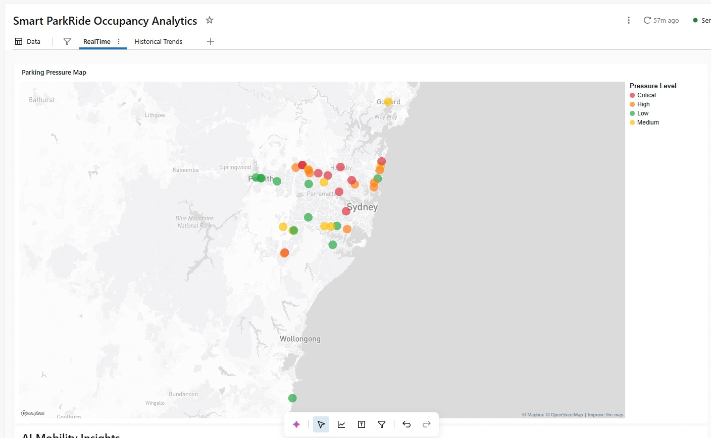
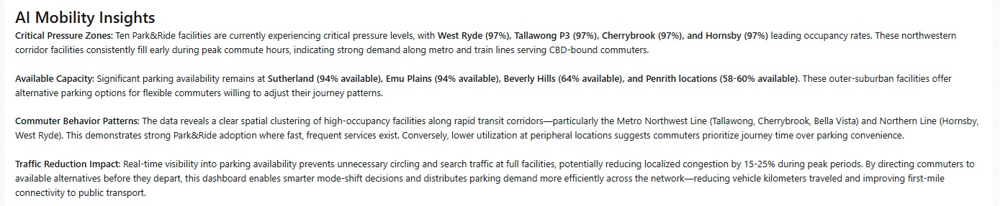
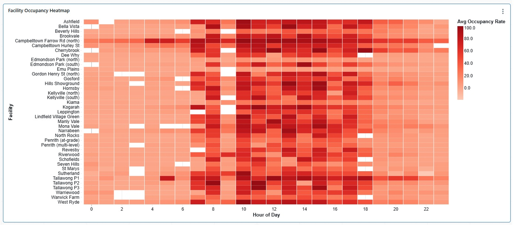
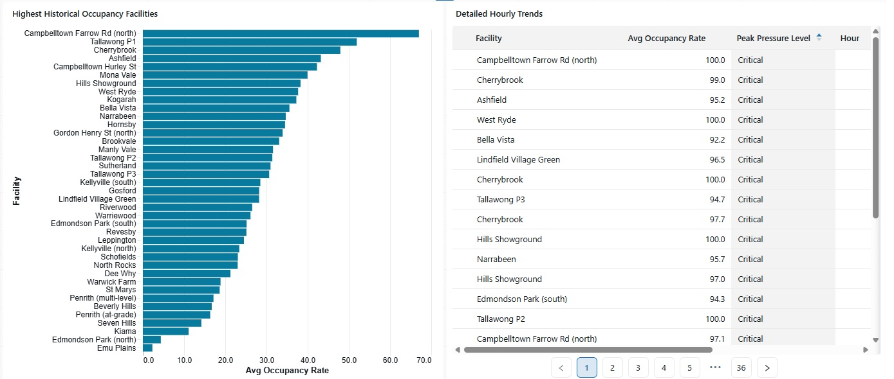
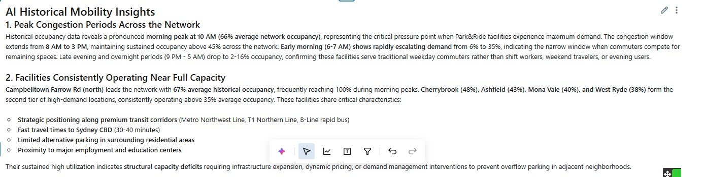

# Smart ParkRide Occupancy Analytics Platform

## Project Overview

Smart ParkRide Occupancy Analytics is a modern lakehouse-based mobility analytics platform built in Databricks that analyzes realtime and historical parking occupancy across Sydney Park&Ride facilities.

The solution combines realtime API ingestion, historical snapshot accumulation, geospatial analytics, AI-generated mobility insights, and interactive dashboards to help understand commuter parking behavior and parking congestion trends across Sydney transport corridors.

The project demonstrates how modern Data Engineering and AI-powered analytics can improve urban mobility visibility and support smarter commuter decisions.

---

# Why This Project Matters

Commuters often waste significant time searching for parking near major transport hubs during peak hours.

Lack of realtime parking visibility contributes to:

- Increased traffic congestion
- Longer commuter delays
- Parking overflow into residential areas
- Higher fuel consumption
- Increased vehicle emissions
- Inefficient utilization of parking infrastructure

This platform transforms raw parking occupancy data into intelligent mobility insights that help identify:

- High-pressure parking corridors
- Peak congestion periods
- Underutilized facilities
- Historical commuter behavior patterns
- Parking demand trends
- Future forecasting opportunities

---

# Key Platform Benefits

## Realtime Parking Intelligence

The platform provides realtime visibility into:

- Current occupancy rates
- Available parking spaces
- Critical congestion zones
- Near-full facilities
- Parking pressure distribution across Sydney

This can help reduce unnecessary parking search traffic and improve commuter decision-making.

---

## Historical Mobility Analytics

Because the Bronze layer continuously accumulates historical snapshots, the platform can analyze:

- Hourly occupancy trends
- Peak congestion windows
- Long-term parking behavior
- Facility utilization patterns
- Demand evolution over time

This enables future predictive analytics and forecasting opportunities.

---

## Geospatial Analytics

The platform uses latitude and longitude coordinates from the API to generate spatial parking analytics.

This enables:

- Parking pressure maps
- Geographic congestion visualization
- Corridor demand analysis
- Spatial occupancy clustering
- Smart mobility insights

---

## AI-Generated Insights

Databricks Genie AI was used to automatically generate mobility insights directly from analytical datasets.

The AI insights identify:

- Facilities operating near full capacity
- Peak congestion periods
- Historical commuter patterns
- Underutilized facilities
- Structural parking demand issues
- Opportunities for congestion reduction

---

# Realtime Dashboard

## KPI & Operational Monitoring



The realtime operational dashboard provides:

- Total facilities monitored
- Average occupancy rate
- Total available parking spaces
- Critical facilities count
- Facility congestion ranking
- Realtime parking availability tables

---

## Parking Pressure Geospatial Map



The parking pressure map visualizes congestion levels geographically across Sydney using color-coded occupancy pressure indicators.

Pressure Levels:

- 🔴 Critical
- 🟠 High
- 🟡 Medium
- 🟢 Low

This helps identify major congestion corridors and high-demand commuter regions.

---

## AI Mobility Insights



Databricks Genie AI automatically generated mobility intelligence insights based on realtime parking occupancy patterns.

The AI identifies:

- Critical congestion zones
- Alternative parking opportunities
- High-demand transport corridors
- Commuter behavior trends
- Traffic reduction opportunities

---

# Historical Trends Dashboard

## Historical Occupancy Heatmap



The heatmap visualizes historical parking occupancy patterns across all facilities and hours of the day.

Insights include:

- Morning peak congestion periods
- Sustained occupancy windows
- Facility demand intensity
- Hourly commuter behavior patterns

---

## Historical Facility Rankings & Trends



The historical dashboard ranks facilities by long-term occupancy performance and highlights persistent congestion patterns.

This helps identify:

- Consistently overloaded facilities
- Underutilized parking assets
- Structural parking demand trends
- Historical utilization behavior

---

## AI Historical Mobility Insights



Databricks Genie AI analyzes historical parking behavior and automatically generates strategic mobility insights.

The AI identifies:

- Peak congestion periods
- Long-term parking demand patterns
- Structural parking shortages
- Underutilized facilities
- Corridor-level commuter behavior

---

# Solution Architecture

## Medallion Architecture

The platform follows a modern Bronze → Silver → Gold lakehouse architecture pattern.

```text
Transport for NSW API
            ↓
        Bronze Layer
   Raw Historical Snapshots
            ↓
        Silver Layer
 Normalized Operational Tables
            ↓
         Gold Layer
   Business KPIs & Analytics
            ↓
 Databricks AI Dashboards
```

---

# Technologies Used

- Databricks
- PySpark
- Delta Lake
- SQL
- Databricks Dashboards
- Databricks Genie AI
- Medallion Architecture
- Geospatial Analytics
- Realtime API Ingestion
- Historical Snapshot Accumulation

---

# Data Source

Transport for NSW Park&Ride API

```text
https://api.transport.nsw.gov.au/v1/carpark/full-list
```

The API provides realtime occupancy information for selected commuter Park&Ride facilities across Sydney.

---

# Data Pipeline

# Bronze Layer

## Table

```text
smart_carparking.bronze_carpark_raw
```

## Purpose

Stores raw API snapshots exactly as received from the API.

## Features

- Append-only ingestion
- Historical snapshot accumulation
- Raw JSON preservation
- Ingestion timestamps
- Source tracking

## Why Bronze Matters

Because snapshots are continuously appended, the platform builds a growing historical dataset over time.

This enables:

- Time-series analytics
- Historical trend analysis
- Peak-hour detection
- Future forecasting opportunities

---

# Silver Layer

## Tables

```text
smart_carparking.silver_carpark_occupancy
smart_carparking.silver_carpark_zones
```

## Purpose

Transforms and normalizes nested JSON structures into analytical operational tables.

---

## Facility Occupancy Table

Contains:

- Facility-level occupancy
- Available spaces
- Occupancy rates
- Facility metadata
- Geospatial coordinates

---

## Zone Occupancy Table

Contains:

- Internal parking zones
- Zone occupancy metrics
- Zone-level pressure analysis
- Zone availability information

---

## Why Separate Facility and Zone Tables?

The API contains nested zone structures where one facility can contain multiple parking zones.

Separating these structures improves:

- Data normalization
- Query performance
- Dashboard scalability
- Analytical flexibility

This follows standard enterprise data modeling practices.

---

# Gold Layer

## Tables

```text
smart_carparking.gold_current_facility_status
smart_carparking.gold_hourly_occupancy_trends
```

## Purpose

Provides business-ready analytical tables optimized for dashboards and KPI reporting.

---

## Current Facility Status

Provides:

- Current occupancy rates
- Available parking spaces
- Pressure classifications
- Operational KPIs

Used for:

- Realtime monitoring
- Operational dashboards
- Parking intelligence

---

## Historical Occupancy Trends

Provides:

- Historical occupancy patterns
- Hourly demand trends
- Peak congestion analysis
- Long-term utilization metrics

Used for:

- Historical analytics
- AI mobility insights
- Trend visualization
- Future forecasting opportunities

---

# Historical Snapshot Strategy

The platform continuously accumulates historical snapshots using an append-only Bronze ingestion strategy.

This enables:

- Historical occupancy analysis
- Trend evolution tracking
- Time-series analytics
- AI forecasting opportunities
- Long-term mobility intelligence

---

# Future Improvements

Potential future enhancements include:

- Machine learning occupancy forecasting
- Predictive parking recommendations
- Dynamic congestion alerts
- Alternative parking routing
- Real-time commuter notifications
- Streaming ingestion architecture
- Near realtime processing
- AI anomaly detection
- Predictive congestion scoring

---

# Project Structure

```text
Smart-Parking-Analytics/
│
├── notebooks/
│   ├── 00_setup
│   ├── 01_bronze_ingestion
│   ├── 02_silver_transform
│   └── 03_gold_transform
│
├── screenshots/
│   ├── KPIandTables.jpg
│   ├── PressureMaps.jpg
│   ├── AIInsights.jpg
│   ├── HistoricalHeatGraph.jpg
│   ├── HistoricalTables.jpg
│   └── HistoricalInsights.jpg
│
└── README.md
```

---

# How to Run

## 1. Configure API Access

Add your Transport for NSW API key.

---

## 2. Run Bronze Ingestion

Run:

```text
01_bronze_ingestion
```

This ingests realtime API data into the Bronze layer while continuously accumulating historical snapshots.

---

## 3. Run Silver Transformations

Run:

```text
02_silver_transform
```

This normalizes nested JSON structures into operational analytical tables.

---

## 4. Run Gold Transformations

Run:

```text
03_gold_transform
```

This creates business-ready KPI and historical trend tables.

---

## 5. Refresh Dashboards

Refresh the Databricks AI dashboards to visualize the latest realtime and historical analytics.

---

# Key Learning Areas

This project demonstrates practical experience with:

- Data Engineering
- Medallion Architecture
- Delta Lake
- PySpark
- SQL
- Realtime API ingestion
- Historical snapshot accumulation
- JSON normalization
- Geospatial analytics
- Dashboard development
- AI-assisted analytics
- Gold-layer KPI modeling
- Databricks Lakehouse concepts

---

# Conclusion

This project demonstrates how modern Data Engineering, realtime analytics, historical snapshot accumulation, geospatial intelligence, and AI-generated insights can be combined to create a smart mobility analytics platform.

The solution transforms raw parking occupancy data into actionable commuter intelligence capable of supporting smarter transportation decisions, reducing parking search traffic, and improving visibility across urban mobility networks.
